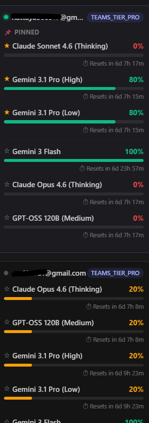
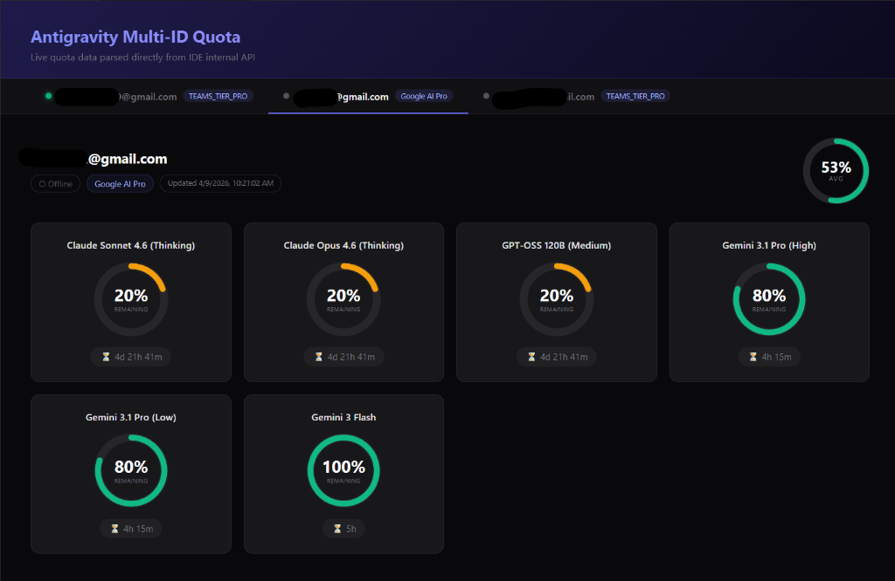

# 🚀 Antigravity Multi-ID Quota Dashboard

**Monitor your Antigravity AI quota usage in real-time — fully standalone, no dependencies required.**


> 💡 **New in v1.0.9:** Introducing **Model Pinning**! Pin your most used models in the sidebar to keep them permanently visible in your VS Code Status Bar with clean, short names and color-coded status indicators.

---

## 🌟 Overview

**Antigravity Multi-ID Quota** is a lightweight, fully self-contained VS Code extension that tracks your AI coding assistant quota in real-time.

It works by scanning running **Antigravity Language Server** processes, extracting their internal ports and CSRF tokens, and fetching live quota data directly from the IDE's internal API — no third-party extensions or log files needed.

---

## ✨ Features

### 📌 Model Pinning (New!)
Keep track of the models you care about the most:

<div align="center">
  
</div>

- **Pin from Sidebar:** Click the star icon (☆ / ★) next to any model in the Antigravity sidebar panel.
- **Smart Status Bar:** Pinned models instantly appear in the bottom-right Status Bar.
- **Clean Naming:** Model names are intelligently shortened (e.g., `Gemini 3.1 Pro (High)` becomes `Pro (High)`).
- **Color-Coded Status:** 
  - ✅ Green (≥ 50% remaining)
  - ⚠️ Yellow (20% - 49% remaining)
  - ❌ Red (< 20% remaining)
  - *Example:* `✅ Pro (High): 80% | ❌ Sonnet: 0%`
- **Dynamic Reordering:** Pinned models are automatically moved to a dedicated "📌 PINNED" section at the top of the sidebar for easy access.

### 📊 Multi-Account Dashboard

<div align="center">
  
</div>

- Supports **multiple accounts simultaneously** — each account gets its own tab in the full dashboard.
- Displays live **quota percentage** per AI model with interactive circular gauges.
- Shows raw **tier name** directly from the API (e.g., `TEAMS_TIER_PRO`, `Google AI Pro`).
- Displays **reset time** countdowns per model.

### 🔌 Native Process Scanner
- Detects running Antigravity Language Server instances automatically.
- Extracts runtime port and CSRF token from process arguments.
- Communicates securely with the internal API locally.

---

## 🚀 How to Use

1. **Open the Sidebar:** Click the Antigravity Quota icon in the VS Code Activity Bar (left/right side).
2. **View Accounts:** If multiple accounts are logged into the language server, you'll see them listed.
3. **Pin Models:** 
   - Hover over a model and click the **Star Icon (☆)** to pin it.
   - The model will move to the "📌 PINNED" section.
   - Look at the bottom-right of your VS Code window — your **Status Bar** will immediately update to show the pinned model's live quota!
4. **Open Full Dashboard:** Click the "Full Dashboard" button in the sidebar (or run the `AGQ: Open Quota Dashboard` command) for large, detailed visual gauges and alternative offline accounts.
5. **Force Refresh:** Click "↺ Refresh" in the sidebar if you need an immediate sync from the language server.

---

## 🛠 Installation

### From `.vsix`
1. Download the latest `.vsix` from [Releases](https://github.com/ManaphatDev/Antigravity-Multi-ID-Quota/releases)
2. In VS Code: `Extensions` module → `...` menu → `Install from VSIX...`

### Build from Source
```bash
git clone https://github.com/ManaphatDev/Antigravity-Multi-ID-Quota.git
cd Antigravity-Multi-ID-Quota
npm install
npm run package
```
Then install the generated `.vsix` file.

---

## 💻 Commands

| Command | Description |
|---|---|
| `AGQ: Open Quota Dashboard` | Open the full interactive multi-account dashboard |
| `AGQ: Refresh Quota` | Force an immediate Native Quota sync |

---


## 📋 Requirements

- **OS:** Windows (currently relies on `netstat` + `wmic` for local process scanning).
- **IDE:** VS Code `1.85+` or compatible IDE.
- **Prerequisite:** You must have the main Antigravity extension installed and be **logged in**. The language server process must be running for AGQ to detect it.

---

## 📜 License

MIT © [ManaphatDev](https://github.com/ManaphatDev)
